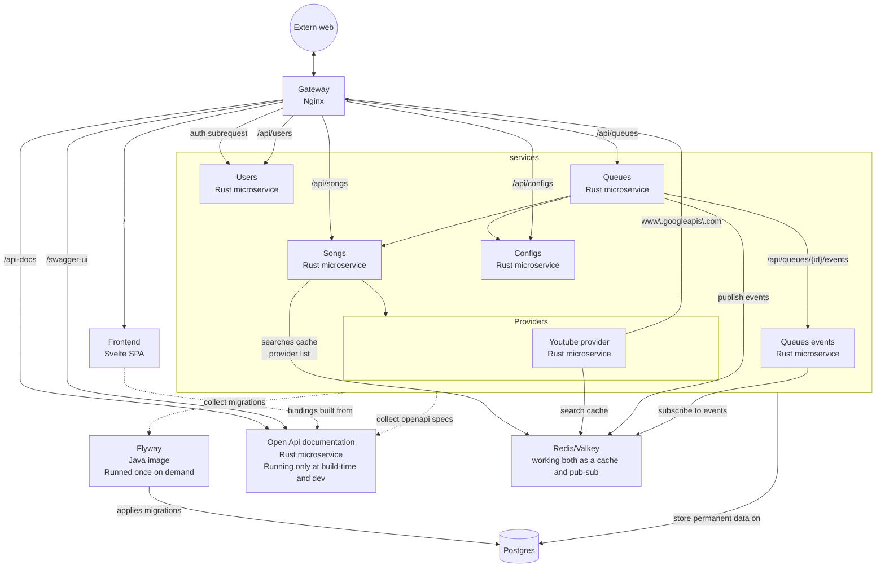

# `apelle` 2.0.0-alpha

> A communist music queue

`apelle` is a service for handling a shared music queue. Users can insert songs
in the queues, and upvote them to push them upward. `apelle` will track the
position of each song in the queue, and the position of the currently playing
song.

It also fetch the song data from the sources (for now, only Youtube is
supported). Users provides only the minimal necessary to identify the song (e.g.
the youtube video ID).

## Local developement

The services can be built and run with `docker compose up --build -d`. Each
service has a corresponding compose file that specifies dependencies.

The `gateway` service will be available at `http://localhost:8080`, and
corresponds to how a user would use the service. Additionally, each service
exposes the port it uses, enabling testing of the single service.

### Ports for local developement

| Service       | Port |
|---------------|------|
| front         | 3000 |
| db            | 5432 |
| cache-pubsub  | 6379 |
| api-docs      | 8079 |
| gateway       | 8080 |
| users         | 8081 |
| songs         | 8082 |
| queues        | 8083 |
| configs       | 8084 |
| queues-events | 8085 |
| songs-youtube | 8091 |

## Swagger

The public api is available and testable through the [Swagger
UI](http://localhost:8080/swagger-ui). A valid account must be provided, and
will be used for authentication.

The api-docs of the single services can be found by navigating to [the internal
swagger](http://localhost:8079/swagger-ui).

## Services

This is the full graph of the services, with the dependencies between them.



Following is a short description of each service. See the dedicated `README.md`
in each service directory for more details.

## `db`
A simple postgres instance. It is used to store all permanent data.

## `migrator`
A container used to handle migrations. It is configured to migrate `db` at
startup, with the migration collected from all the others services.

## `gateway`
An nginx instance, working as the entry point to the costellation. It has two
main functions: handling authentication, and routing to the various services. On
an incoming request it forwards the request headers with a `GET` on the `/auth`
endpoint of the `users` services. If the request authenticate with success, the
headers returned by the auth services are added to the request and the final
result is forwarded to the `/public` endpoint of the service.

## `cache-pubsub`
A valkey instance working a double function. First, it provide a common pub-sub
to communicate real-time events (likes and song additions). Second, it serves as
a cache for volatile data like youtube searches and registered providers.

### `users`
User service. Handles authentication, and user management.

### `songs`
Song service. Keep track of songs, sources, and the providers for each source.
Route every request of a song to the registered providers.

### `songs-<source>`
Song providers. Handle communication with the given source. Register themselves
at runtime on the `songs` service.

### `queues`
Queue service. Keep track of the position of each song in the queue, and the
currently playing song.

### `configs`
Queue configurations service. Keep track of the configuration of each queue.

### `queues-events`
Queue events service. Receives events from the pub-sub, and trasmits them to the
frontend as [SSE](https://en.wikipedia.org/wiki/Server-sent_events).

### `api-docs`
api-docs API documentation, serving [api-docs
UI](https://api-docs.io/tools/api-docs-ui/), the openapi specifications from all
the services, and an aggregate for the public api served by nginx.

## Prod-like mode

The docker compose is already configured to deploy the services in prod-like
mode, by using a different compose override file:
```bash
docker compose -f compose.yml -f compose.prod.yml up --build -d
```

This will compile the services in release mode, and setup them with no file
logging. It will also expose the main gateway port on the port 80 instead of
8080.